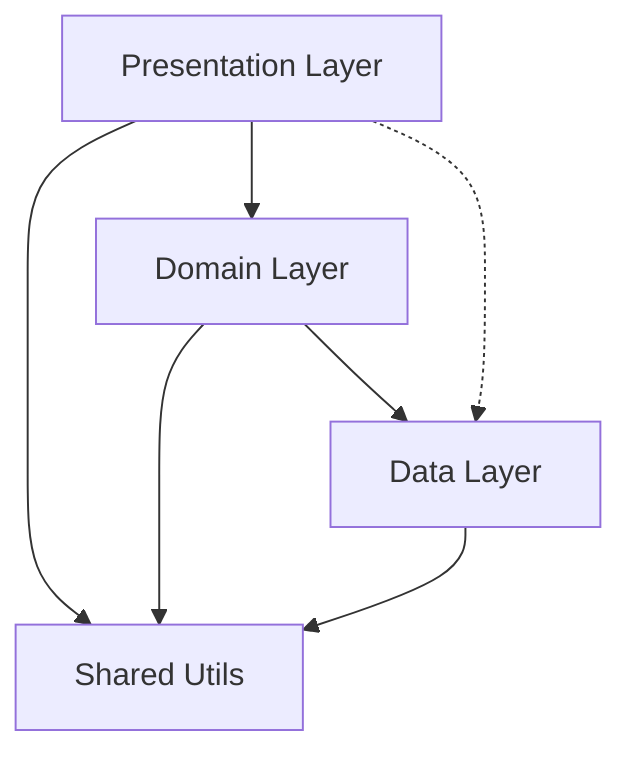
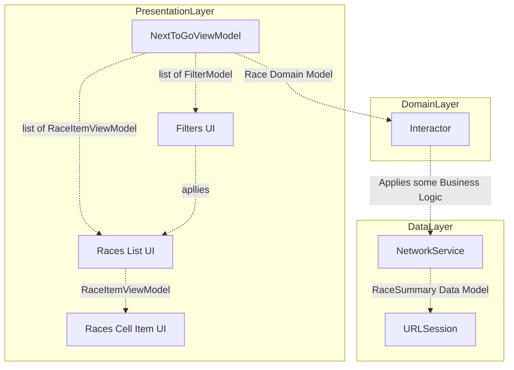

# Next To Go
An app made with ❤️ to demonstrate some examples of **clean architecture**, **code organisation**, **loose coupling**, **unit testing**, **accessibility** and some of the best practices used in modern iOS programming using `Swift` & `SwiftUI`

## 📱 App Goal
Create an iOS app that displays ‘Next to Go’ races using Neds free public API.
A user should always see top 5 races, and they should be sorted by time ascending. Race should disappear from the list after 1 min past the start time. Take some inspirations from popular betting apps like Neds, Ladbrokes, Sportsbet etc.

### 💼 Requirements
1.	As a user, I should be able to see a time ordered list of races ordered by advertised start ascending
2.	As a user, I should not see races that are one minute past the advertised start 
3.	As a user, I should be able to filter my list of races by the following categories: Horse, Harness & Greyhound racing
4.	As a user, I can deselect all filters to show the next 5 from of all racing categories
5.	As a user I should see the meeting name, race number and advertised start as a countdown for each race.
6.	As a user, I should always see 5 races and data should automatically refresh 

## 👨🏽‍💻 Solution Approach
 - App is broken down into 4 logical layers (via Swift Packages)
   1.  DataLayer (Network fetching of raw data and JSON decoding)
   2.  DomainLayer (Business logic of polling and combining data based on filters)
   3.  PresentationLayer (Domain data to SwiftUI binding logic)
   4.  SharedUtils (Common utility helpers and extensions)
  - A mix of **`MVVM`** and **`VIPER`** design pattern is used to acheive loose coupling and unit testing via **`Depdendency Injection`** patterns and mocks
- The package depdencies (import logic from one to another) are shown below:

 
Please refer from the project navigator in Xcode to see the layering.

  

### 💻 Installation
 - Xcode 14 or later (required)
 - Clean /DerivedData folder if any
 - Let the Swift package Manager load and sync
 - Build the project and let the Swift Package Manager pulls two remote **`SwiftLint`** pluggin
 - **iOS 15** minimum support (SwiftUI v4 used)
 - If you're testing on a device, select `automatically manage signing` options
 - 💗 Please 🙏🏽 test on a real iPhone to play with the **Haptics** feedbacks added :) 💗

## ♿️ Accessibility
- Each elements on the app are fully `VoiceOver` compatible (Test on a device to hear the sounds)
- Some Text elements have been combined to give overall accessbility label (icons are excluded)
- Custom accessibility hints are also applied to buttons (eg. Fiters)
- Filters do annouce the VoiceOver labels for visually impaired users, and updates their traits between `button` and `selected`
- All texts on UI can grow with system level font scaling and auto reposition themselves when needed to fit better within the container
- UI also adapts to layout chnages - landscape / potrait modes (including iPad support)

### 🚀 Extra Features
- A settings more menu has been made to show extra info and author attribution and demonstrate how easy & fast SwiftUI is to build such layouts
- Some custom SwiftUI animations are applied to many icons
- Dark mode toggle can be applied from Settings
- Loading shimmers are added when refreshing races & changing between race category filters

### ⛈️ Error Handling UX
- Custom error UI are shown when loading error occurs
- `NetworkFailure` (i.e. internet disconnected) shows its custom message and animated icon
- All other server errors have a generic message and animated icon
- If no races are found from API for some odd reason, then empty state also shows with some messaging
