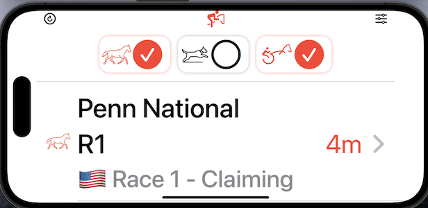

# 🏇🏼 Next To Go
An app made with ❤️ to demonstrate some examples of **clean architecture**, **code organisation**, **loose coupling**, **unit testing**, **accessibility** and some of the best practices used in modern iOS programming using `Swift` & `SwiftUI`

## 📱 App Goal
Create an iOS app that displays `Next to Go` races using Neds free public API.
A user should always see top 5 races, and they should be sorted by time ascending. Race should disappear from the list after 1 min past the start time. Take some inspirations from popular betting apps like Neds, Ladbrokes, Sportsbet etc.

### 💼 Requirements
1.	As a user, I should be able to see a time ordered list of races ordered by advertised start ascending
2.	As a user, I should not see races that are **one minute past** the advertised start 
3.	As a user, I should be able to filter my list of races by the following categories: Horse, Harness & Greyhound racing
4.	As a user, I can deselect all filters to show the next 5 from of all racing categories
5.	As a user, I should see the meeting name, race number and advertised start as a countdown for each race.
6.	As a user, I should always see 5 races and data should automatically refresh 

## 👨🏽‍💻  Solution Approach

> Before we move onto breaking down the app layers and architecture, let's  read some of the best practices and how other SwiftUI developers in the community are feeling about various ways to architect a scalable app. 

>> This article on [clean-architecture-swiftui](https://nalexn.github.io/clean-architecture-swiftui/) summarises the story quite well 🙏🏽

| Clean Architecture with MVVM |
| ---------------------------  |
|  |

After reading it, I made this following decisions to go ahead and use some aspects of the `VIPER` pattern and mixing in with `MVVM`  while still having core concepts of `clean architecture` from uncle Bob 🧔🏼‍♂️. 

Codebase is broken down into 4 logical layers (via `Swift Packages`)
- `DataLayer`:
    - Network fetching of raw data and JSON decoding via URL, error code mapping etc.
- `DomainLayer`:
    - Business logic of polling and combining data based on filters, sorting of top 5 based on timing etc.
    - `Interactor`s live here. (aka. `UseCase` in some codebases)
- `PresentationLayer`:
    - Domain data to SwiftUI binding logic
    - All UI specific code (SwiftUI OR UIKit)
- `SharedUtils`:
    - Common light weight utility helpers and extensions

- A mix of **`MVVM`** and **`VIPER`** design pattern is used to achieve loose coupling and unit testing via **`Dependency Injection`** patterns and mocks
- Currently use Apple's `Combine` based `Reactive Binding`
- ✋🏽`TODO`: Migrate from `Combine` driven Publishers into `Swift`'s **Modern Concurrency Async Await** paradigm (layer by layer where feasible and makes sense)
- `Unit Testing` (about 70%) has been covered on each layer. (More being added iteratively...)
- Some TODO notes left in the code deliberately for potential improvements and SwiftLint warns us about those to trace them
- To achieve the **requirement 2** above, use ⏰ **hard negative tolerance** in the interactor (currently set at -90 seconds). This can be configured to show more old races which are past few minutes with negative countdown timer on the UI. Configurable option in the app logic. 🤓

The package dependencies (import logic from one to another) are shown below:

 
Please refer from the project navigator in Xcode to see the layering.

| Project  | Targets | Tests |
| ------ | -------- | ---- |
|   |     |     |

## The overall summary in terms of UML 

## 💻 Installation
 - Xcode 14 or later (required)
 - Clean build /DerivedData folder if any
 - Let the Swift package Manager load and sync
 - Build the project and let the Swift Package Manager pulls the remote **`SwiftLint`** pluggin
 - **iOS 15** minimum support (SwiftUI v4 used)
 - If you're testing on a device, select `automatically manage signing` options
 - 💗 Please 🙏🏽 test on a real iPhone to play with the **Haptics** feedbacks added :) 💗

## ♿️ Accessibility
- Each elements on the app are fully `VoiceOver` compatible (Test on a device to hear the sounds)
- Some Text elements have been combined to give overall accessibility label (icons are excluded)
- Custom accessibility hints are also applied to buttons (eg. Filters)
- Filters do announce the VoiceOver labels for visually impaired users, and updates their traits between `button` and `selected`
- All texts on UI can grow with system level font scaling and auto reposition themselves when needed to fit better within the container
- UI also adapts to layout changes - landscape / portrait modes (including iPad support)

## 🚀 Extra Features
- A settings more menu has been made to show extra info and author attribution and demonstrate how easy & fast SwiftUI is to build such layouts
- Some custom SwiftUI animations are applied to many icons (all `SFSymbol`s and some custom made SF symbol such horse, harness etc.)
- Dark mode toggle can be applied from Settings (there is a minor 🐞 bug there now, after applying this, shimmers go funny and does not update, app kill and restart needed)
- Loading shimmers are added when refreshing races & changing between race category filters

## ⛈️ Error Handling UX
- Custom error UI is shown when loading error occurs
- `NetworkFailure` (i.e. internet disconnected) shows its custom message and animated icon
- All other server errors have a generic message and animated icon
- If no races are found from API for some odd reason, then empty state also shows with some messaging

## Screenshots

| Filtering Races | Settings |
| ------ | ---- |
|   |   |

#### Errors (Test steps included)

| Empty State  | Generic Sever Error | Internet Lost Error |
| ------ | ---- | --- |
|  Update code in `NextRacesInteractor.swift` to return `[]` by commenting out `results.append(..)` statement around line 65 | Update the API endpoint in `ApiConstants` to something incorrect URL | Disconnect WiFi & connect back and test |
|    |    |    |

| Dark modes |  |
| ------ | ---- |
|    |    | 

# Accessibility

| Dynamic Font Scaling  |
| --------- | 
|  |

| 🎧 VoiceOver 📢 Labels and Traits & sounds 🎼 | 
| ---------- | 
|  |

## 📢 Play with the `mov` videos below to see VoiceOver in action

 - Turn the sounds ON within the player (default muted)

https://github.com/arinjoy/next-to-go/assets/7835943/a4b63859-01cb-4ec4-a349-0f273d538bb5

https://github.com/arinjoy/next-to-go/assets/7835943/ca42118b-7d60-4b30-8b71-490aea6be443

| Portrait Large | Landscape Large  |
| ------ | ---- |
|  |  | 
